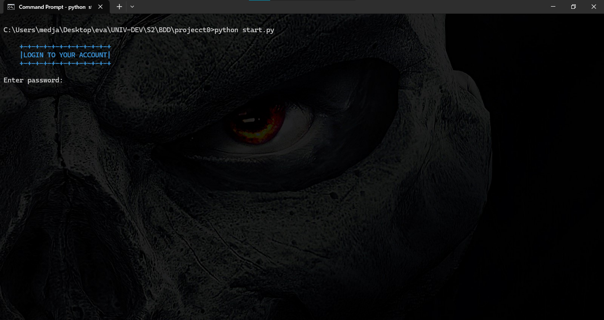
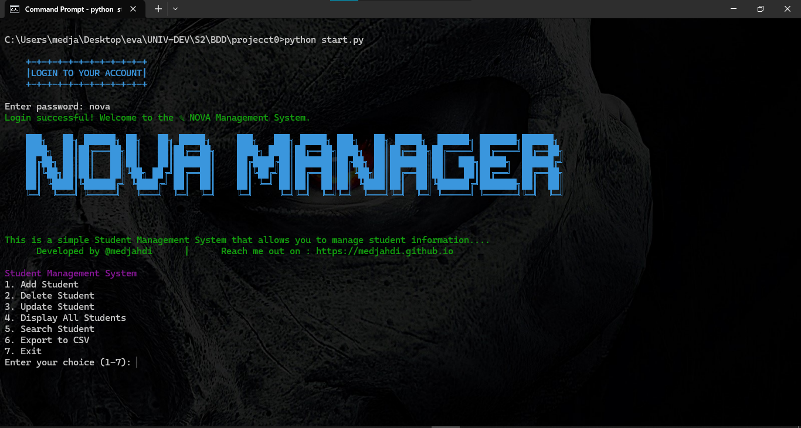

# Student Management System

This is a **Student Management System** built using Python and MySQL. It allows you to manage student information efficiently by performing CRUD (Create, Read, Update, Delete) operations. The project is open-source and does not have any license. All rights reserved by [@medjahdi](https://medjahdi.github.io).

---

## Features

- **Add Student**: Add a new student to the database.
- **Delete Student**: Delete a student by ID.
- **Update Student**: Update student information by ID.
- **Display All Students**: Display all students in the database.
- **Search Student**: Search for a student by ID or name.
- **Export to CSV**: Export student information to a CSV file.

---

## Getting Started

### Prerequisites

Before running the application, ensure you have the following installed:

- **Python 3.x**: Download and install Python from [python.org](https://www.python.org/).
- **MySQL**: Install MySQL from [mysql.com](https://www.mysql.com/).

---

### Setting Up the Database

1. Log in to MySQL:
    ```sh
    mysql -u root -p
    ```

2. Create the database and `students` table:
    ```sql
    CREATE DATABASE student_management;

    USE student_management;

    CREATE TABLE students (
        id VARCHAR(10) PRIMARY KEY,
        name VARCHAR(50),
        surname VARCHAR(50),
        dob DATE,
        address VARCHAR(100),
        nationality VARCHAR(50),
        faculty VARCHAR(50),
        department VARCHAR(50),
        specialization VARCHAR(50),
        year VARCHAR(10)
    );
    ```

---

### Installation

1. Clone the repository:
    ```sh
    git clone https://github.com/medjahdi/student-management-system.git
    cd student-management-system
    ```

2. Install the required Python packages:
    ```sh
    pip install mysql-connector-python termcolor
    ```

---

### Running the Application

To start the application, run the following command:

```sh
python start.py
```

---

## Project Structure

The project is organized as follows:

- **`start.py`**: The main script to run the application.
- **`login.py`**: Handles the login functionality with a hashed password.
- **`app.py`**: Implements the core functionality (CRUD operations, search, and export).
- **`README.md`**: This file, providing an overview of the project.

---

## Login Form

The login form uses a **hashed password** for security. The default password is `"nova"`, which is hashed using **SHA-256**. You will be prompted to enter the password when you start the application.

---

## Main Program

The main program allows you to perform the following operations:

1. **Add Student**: Add a new student to the database.
2. **Delete Student**: Delete a student by ID.
3. **Update Student**: Update student information by ID.
4. **Display All Students**: Display all students in the database.
5. **Search Student**: Search for a student by ID or name.
6. **Export to CSV**: Export student information to a CSV file.

---

## Project Description

This project demonstrates how to interact with a **MySQL database** using Python. It covers the following concepts:

- Connecting to a MySQL database.
- Performing CRUD operations.
- Using hashed passwords for secure login.
- Exporting data to a CSV file.

---

## Screenshots 

If you have screenshots of your application, you can add them here. For example:




---

## Contributing

Contributions are welcome! If you'd like to contribute, please follow these steps:

1. Fork the repository.
2. Create a new branch (`git checkout -b feature/YourFeatureName`).
3. Commit your changes (`git commit -m 'Add some feature'`).
4. Push to the branch (`git push origin feature/YourFeatureName`).
5. Open a pull request.

---

## License

This project does not have a license. All rights are reserved by [@medjahdi](https://medjahdi.github.io).

---

## Contact

Developed by [@medjahdi](https://medjahdi.github.io).  
Reach out to me on: [https://medjahdi.github.io](https://medjahdi.github.io)

```
